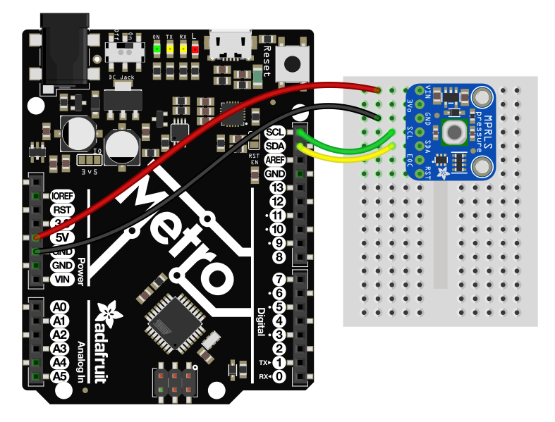
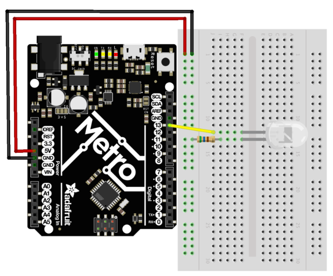
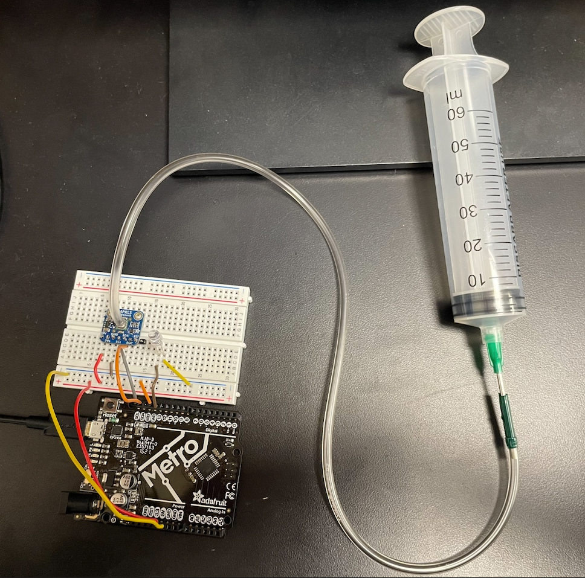

# Bronco Ejection Mode Prototype

Protocol for initial adafruit metro/MPRLS/LED blink prototype
------------------------------------------------------------------------------------------------------------------------------------
Connect the following pins to the following pins on MPRLS to the Adafruit Metro:
- Vin to 5V
- GND to GND
- SCL to SCL
- SDA to SDA

To test, run mprls_simpletest.ino on the Metro. This code will read the pressure from the MPRLS sensor and print it to the serial monitor.

Connect an LED to the 13 pin of the Metro, with the long leg of the LED connected to the 13 pin and the short leg connected to the GND pin.

To test, run LED_blink_test.ino on the Metro. This code will blink the LED on and off at a rate of 1 Hz.

To complete the apparatus, 
connect a 3/32" ID tubing to the MPRLS sensor port and connect the other end to a pressure source. The pressure source can be a hand pump, a compressed air source, or any other source of pressurized air.  
- i.e: A tapered syringe can be used to apply pressure to the MPRLS sensor as well as create a negative pressure vaccuum.

For more information on the MPRLS sensor, see the following link:
https://www.adafruit.com/product/3965

For the primary guide on the MPRLS sensor set up, see the following link:
https://learn.adafruit.com/adafruit-mprls-ported-pressure-sensor-breakout

      
-Isaac <3